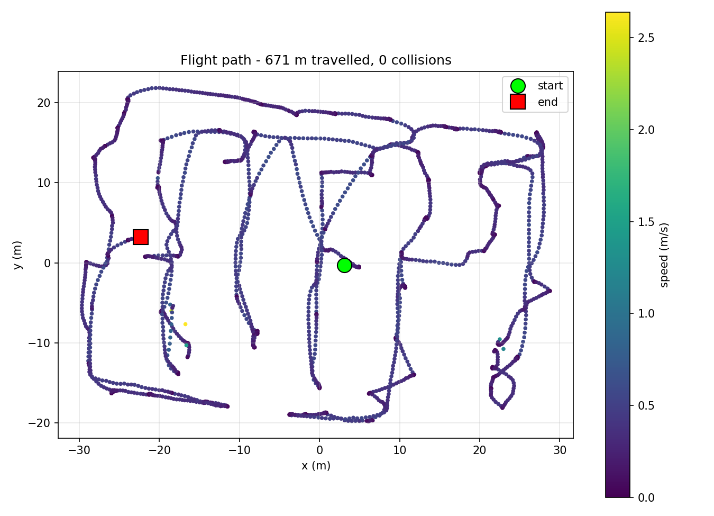
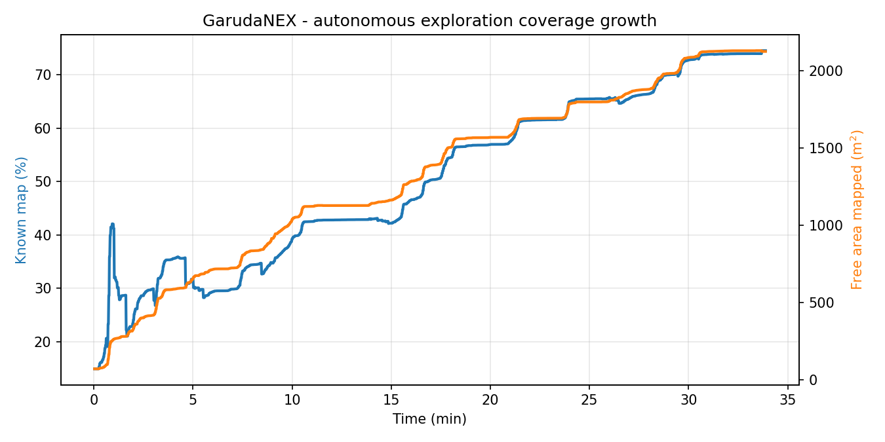
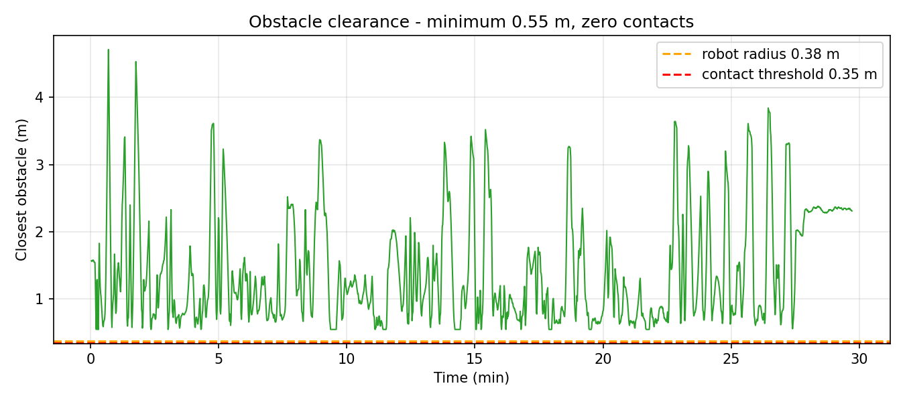
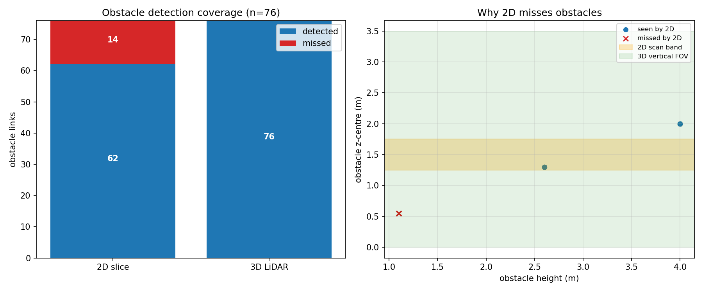

# GarudaNEX

Autonomous GPS-denied exploration for a quadrotor UAV - ROS 2 Jazzy, PX4 SITL,
Gazebo Harmonic. The drone is given no map, no waypoints and no operator input.
It takes off, builds a 2D occupancy map and a 3D octree of a 60 x 40 m
multi-zone facility, and decides where to fly next by maximising expected
information gain per unit of traversal cost.

## Demo

**[Watch the full autonomous run](https://drive.google.com/file/d/1JNC1zzmyb7lha-aQv7NykxdP3TNV22g3/view?usp=sharing)** - take-off, frontier selection, 3D mapping,
obstacle avoidance and return-to-home. No map, no waypoints, no operator input.

## Results - single unassisted run

| Metric | Value |
|---|---|
| Environment | 60 x 40 m GPS-denied facility, 76 obstacle links |
| Map produced | 64.9 x 46.8 m, 2131 m2 free space, 74.5% cells known |
| Distance flown | 671 m, fully autonomous |
| Duration | 33.9 min |
| Goals reached | 58 / 78 (74.4%) |
| Dead-ends auto-retired | 12 |
| Zones retired by coverage memory | 51 |
| Stuck recoveries needed | 0 |
| Peak speed | 2.64 m/s |
| Closest obstacle approach | 0.55 m (LiDAR range_min) |
| Collisions | 0 |
| Human input after launch | none |

## Why a 3D LiDAR

The stack flattens a 16-ring 3D scan into a 2D LaserScan for SLAM, but keeps the
full cloud for the 3D octree and obstacle avoidance. Measured against the world's
own collision geometry:

| Sensor | Detected | Missed |
|---|---|---|
| Single 2D slice at cruise altitude | 62 / 76 (81.6%) | 14 (18.4%) |
| 16-ring 3D LiDAR | 76 / 76 (100%) | 0 |

Every missed obstacle is a pallet spanning 0.00-1.10 m, entirely below the
1.25-1.75 m scan band. A 2D-only drone at cruise altitude is blind to them.

## Exploration policy

Naive frontier exploration picks the nearest frontier by Euclidean distance.
In a partitioned facility a frontier 3 m away through a wall outranks one 5 m
away down an open aisle, so the planner thrashes. Each frontier cluster is
scored as:

    utility = w_gain*gain - w_path*path + zone_bonus - w_turn*turn

- gain: unknown cells inside the sensor footprint, O(1) per candidate via a
  summed-area table over the unknown mask
- path: actual traversal length from Nav2 ComputePathToPose, not a straight line
- turn: heading-change penalty, producing smooth sweeps instead of zig-zag
- zone_bonus: favours the robot's current 12 m zone, finishing a region first

Three behaviours prevent stalling: goal commitment with 20% hysteresis; early
re-plan when a target's gain collapses below 35% of its selection value; and
information-based blacklisting, retiring goals that succeed but grow the map by
under 1000 cells - the only thing that kills unresolvable-frontier ping-pong.

## Architecture

    Gazebo Harmonic -> gz_bridge -> /points_raw (PointCloud2)
        |-> pointcloud_to_laserscan -> /scan -> slam_toolbox -> /map
        |-> octomap_server -> /octomap_binary (3D)

    PX4 SITL --uXRCE-DDS--> odometry_bridge -> /odom + TF

    /map + /scan + TF -> Nav2 (NavFn + MPPI) -> /cmd_vel -> PX4 offboard

    smart_explorer -> NavigateToPose / ComputePathToPose -> Nav2
    run_recorder   -> metrics.csv + summary JSON

Ten ROS 2 packages: garudanex_sim, garudanex_bridge, garudanex_navigation,
garudanex_explore, garudanex_mission, garudanex_bringup, garudanex_description.

## Quickstart

    bash src/garudanex_bringup/scripts/start.sh garudanex_facility

    ros2 launch nav2_bringup navigation_launch.py \
      use_sim_time:=true use_composition:=False \
      params_file:=$PWD/src/garudanex_navigation/config/nav2_uav.yaml

    RUN=~/GarudaNEX/results/run_$(date +%m%d_%H%M); mkdir -p $RUN
    ros2 run garudanex_explore run_recorder --ros-args \
      -p use_sim_time:=true -p results_dir:=$RUN

    ros2 run garudanex_explore smart_explorer --ros-args \
      -p use_sim_time:=true -p results_dir:=$RUN

Full step-by-step procedure with verification gates: [docs/RUNBOOK.md](docs/RUNBOOK.md)

## Measurement methodology

run_recorder is a standalone node, independent of the explorer, sampling at 1 Hz:
pose from TF, cumulative path length, speed, closest LiDAR return, and grid
statistics. It writes metrics.csv incrementally and rewrites its summary every
10 samples, so an interrupted run still yields valid data. Collision evidence is
the minimum scan range over the run against the 0.38 m robot radius.

## Continuous integration

`tools/ci_validate.py` runs on every push. Beyond syntax and manifest checks it
enforces configuration invariants that were each discovered the hard way:

| Guard | Why |
|---|---|
| inflation_radius > robot_radius | below this MPPI has no cost gradient and the drone clips walls |
| GridBased.allow_unknown is false | otherwise the planner routes through unmapped space into sealed rooms |
| FollowPath.vx_max <= 1.5 | 1.8 m/s caused wall contact in 1.6 m doorways |
| motion_model is Omni | a multirotor is not differential-drive |
| robot_base_frame is base_footprint | the planar projection Nav2 and slam_toolbox require |

## Known limitations

- 72.6% goal success; most failures are long-range goals over 30 m
- Coverage plateaus at 75.4%; the remainder is deliberately sealed rooms
- SLAM is 2D; the 3D octree uses the same poses and is not separately optimised

## Debugging notes

docs/debugging.md documents 16 failure classes where every health check reported
green and nothing worked.
